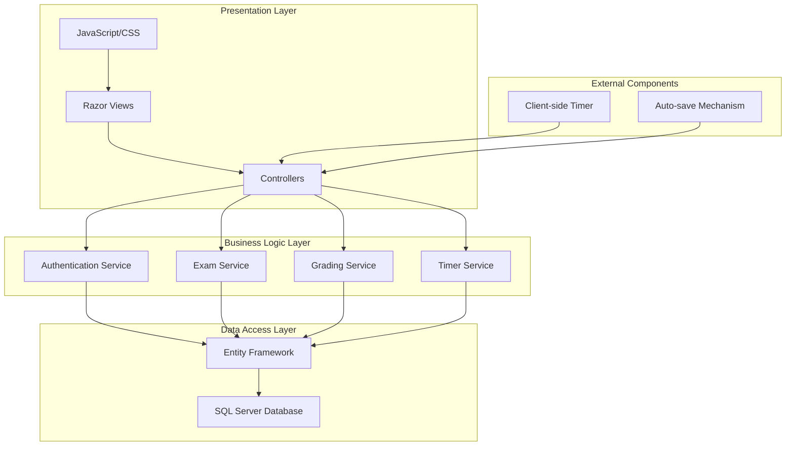
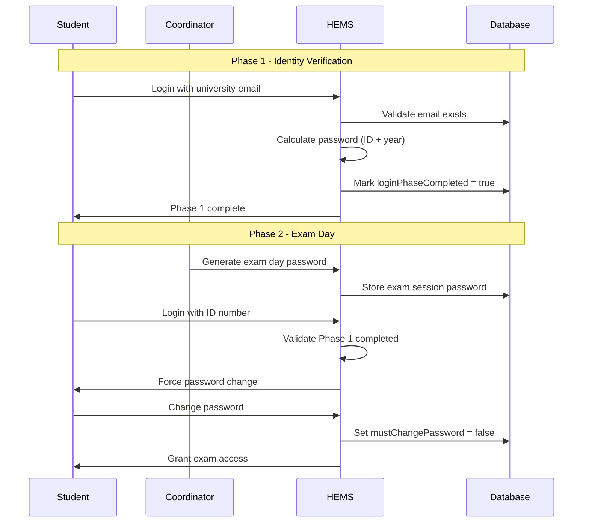

# Design Document

## Overview

The Holistic Examination Management System (HEMS) is a web-based examination platform built using C# ASP.NET MVC (.NET Framework) with SQL Server database. The system implements a secure two-phase authentication mechanism and provides a distraction-free single-question interface for high-stakes academic examinations.

The architecture follows the Model-View-Controller (MVC) pattern with clear separation of concerns between data access, business logic, and presentation layers. The system prioritizes security, data integrity, and user experience optimization for examination scenarios.

## Architecture

### System Architecture

The system follows a three-tier architecture:



### Authentication Flow



## Components and Interfaces

### Core Controllers

#### AuthenticationController

- **Purpose**: Handles two-phase authentication process
- **Key Methods**:
  - `Phase1Login(string email, string password)`: Validates university email and calculated password
  - `Phase2Login(string idNumber, string password)`: Validates exam-day login
  - `ChangePassword(string newPassword)`: Forces password change after Phase 2 login
  - `Logout()`: Terminates user session

#### ExamController

- **Purpose**: Manages exam taking interface and navigation
- **Key Methods**:
  - `StartExam(int examId)`: Initializes exam session
  - `GetQuestion(int questionId)`: Retrieves specific question with choices
  - `SaveAnswer(int questionId, int choiceId)`: Auto-saves student answer
  - `FlagQuestion(int questionId, bool isFlagged)`: Toggles question flag status
  - `SubmitExam()`: Processes final exam submission
  - `GetExamStatus()`: Returns question palette status data

#### CoordinatorController

- **Purpose**: Administrative functions for exam management
- **Key Methods**:
  - `ImportStudents(List<StudentImportModel> students)`: Bulk import student records
  - `CreateExam(ExamCreateModel model)`: Creates new exam for academic year
  - `AddQuestion(int examId, QuestionCreateModel model)`: Adds questions to exam
  - `PublishExam(int examId)`: Makes exam available to students
  - `GenerateExamPassword(string password)`: Sets Phase 2 password for exam session
  - `ViewResults(int examId)`: Displays exam results and statistics

### Service Layer

#### AuthenticationService

- **Responsibilities**:
  - Phase 1 password calculation using ID number and Ethiopian academic year
  - University email domain validation
  - Phase completion tracking
  - Session management

#### ExamService

- **Responsibilities**:
  - Exam availability validation
  - Question retrieval and ordering
  - Answer persistence and validation
  - Timer management and auto-submission

#### GradingService

- **Responsibilities**:
  - Automatic answer evaluation
  - Score calculation (1 point per question)
  - Percentage computation
  - Result storage and retrieval

#### TimerService

- **Responsibilities**:
  - Dynamic time calculation from start_date_time
  - Real-time timer updates
  - Automatic submission on timeout
  - Backend timer enforcement

### Data Models

#### User Model

```csharp
public class User
{
    public int UserId { get; set; }
    public string Username { get; set; }
    public string PasswordHash { get; set; }
    public int RoleId { get; set; }
    public bool LoginPhaseCompleted { get; set; }
    public bool MustChangePassword { get; set; }
    public DateTime CreatedDate { get; set; }

    // Navigation Properties
    public virtual Role Role { get; set; }
    public virtual Student Student { get; set; }
}
```

#### Student Model

```csharp
public class Student
{
    public int StudentId { get; set; }
    public int UserId { get; set; }
    public string IdNumber { get; set; }
    public string UniversityEmail { get; set; }
    public int BatchYear { get; set; }
    public DateTime CreatedDate { get; set; }

    // Navigation Properties
    public virtual User User { get; set; }
    public virtual ICollection<StudentExam> StudentExams { get; set; }
}
```

#### Exam Model

```csharp
public class Exam
{
    public int ExamId { get; set; }
    public string Title { get; set; }
    public int AcademicYear { get; set; }
    public int DurationMinutes { get; set; }
    public bool IsPublished { get; set; }
    public DateTime CreatedDate { get; set; }

    // Navigation Properties
    public virtual ICollection<Question> Questions { get; set; }
    public virtual ICollection<StudentExam> StudentExams { get; set; }
}
```

#### Question Model

```csharp
public class Question
{
    public int QuestionId { get; set; }
    public int ExamId { get; set; }
    public string QuestionText { get; set; }
    public int QuestionOrder { get; set; }
    public DateTime CreatedDate { get; set; }

    // Navigation Properties
    public virtual Exam Exam { get; set; }
    public virtual ICollection<Choice> Choices { get; set; }
    public virtual ICollection<StudentAnswer> StudentAnswers { get; set; }
}
```

#### Choice Model

```csharp
public class Choice
{
    public int ChoiceId { get; set; }
    public int QuestionId { get; set; }
    public string ChoiceText { get; set; }
    public bool IsCorrect { get; set; }
    public int ChoiceOrder { get; set; }

    // Navigation Properties
    public virtual Question Question { get; set; }
    public virtual ICollection<StudentAnswer> StudentAnswers { get; set; }
}
```

#### StudentExam Model

```csharp
public class StudentExam
{
    public int StudentExamId { get; set; }
    public int StudentId { get; set; }
    public int ExamId { get; set; }
    public DateTime StartDateTime { get; set; }
    public DateTime? SubmitDateTime { get; set; }
    public decimal? Score { get; set; }
    public decimal? Percentage { get; set; }
    public bool IsSubmitted { get; set; }

    // Navigation Properties
    public virtual Student Student { get; set; }
    public virtual Exam Exam { get; set; }
    public virtual ICollection<StudentAnswer> StudentAnswers { get; set; }
}
```

#### StudentAnswer Model

```csharp
public class StudentAnswer
{
    public int StudentAnswerId { get; set; }
    public int StudentExamId { get; set; }
    public int QuestionId { get; set; }
    public int? ChoiceId { get; set; }
    public bool IsFlagged { get; set; }
    public DateTime LastModified { get; set; }

    // Navigation Properties
    public virtual StudentExam StudentExam { get; set; }
    public virtual Question Question { get; set; }
    public virtual Choice Choice { get; set; }
}
```

## Data Models

### Database Schema

```sql
-- Roles Table
CREATE TABLE Roles (
    RoleId INT IDENTITY(1,1) PRIMARY KEY,
    RoleName NVARCHAR(50) NOT NULL UNIQUE
);

-- Users Table
CREATE TABLE Users (
    UserId INT IDENTITY(1,1) PRIMARY KEY,
    Username NVARCHAR(100) NOT NULL UNIQUE,
    PasswordHash NVARCHAR(255) NOT NULL,
    RoleId INT NOT NULL,
    LoginPhaseCompleted BIT DEFAULT 0,
    MustChangePassword BIT DEFAULT 1,
    CreatedDate DATETIME2 DEFAULT GETDATE(),
    FOREIGN KEY (RoleId) REFERENCES Roles(RoleId)
);

-- Students Table
CREATE TABLE Students (
    StudentId INT IDENTITY(1,1) PRIMARY KEY,
    UserId INT NOT NULL,
    IdNumber NVARCHAR(20) NOT NULL UNIQUE,
    UniversityEmail NVARCHAR(100) NOT NULL UNIQUE,
    BatchYear INT NOT NULL,
    CreatedDate DATETIME2 DEFAULT GETDATE(),
    FOREIGN KEY (UserId) REFERENCES Users(UserId)
);

-- Exams Table
CREATE TABLE Exams (
    ExamId INT IDENTITY(1,1) PRIMARY KEY,
    Title NVARCHAR(200) NOT NULL,
    AcademicYear INT NOT NULL,
    DurationMinutes INT NOT NULL,
    IsPublished BIT DEFAULT 0,
    CreatedDate DATETIME2 DEFAULT GETDATE()
);

-- Questions Table
CREATE TABLE Questions (
    QuestionId INT IDENTITY(1,1) PRIMARY KEY,
    ExamId INT NOT NULL,
    QuestionText NTEXT NOT NULL,
    QuestionOrder INT NOT NULL,
    CreatedDate DATETIME2 DEFAULT GETDATE(),
    FOREIGN KEY (ExamId) REFERENCES Exams(ExamId)
);

-- Choices Table
CREATE TABLE Choices (
    ChoiceId INT IDENTITY(1,1) PRIMARY KEY,
    QuestionId INT NOT NULL,
    ChoiceText NVARCHAR(500) NOT NULL,
    IsCorrect BIT NOT NULL,
    ChoiceOrder INT NOT NULL,
    FOREIGN KEY (QuestionId) REFERENCES Questions(QuestionId)
);

-- StudentExams Table
CREATE TABLE StudentExams (
    StudentExamId INT IDENTITY(1,1) PRIMARY KEY,
    StudentId INT NOT NULL,
    ExamId INT NOT NULL,
    StartDateTime DATETIME2 NOT NULL,
    SubmitDateTime DATETIME2 NULL,
    Score DECIMAL(5,2) NULL,
    Percentage DECIMAL(5,2) NULL,
    IsSubmitted BIT DEFAULT 0,
    FOREIGN KEY (StudentId) REFERENCES Students(StudentId),
    FOREIGN KEY (ExamId) REFERENCES Exams(ExamId),
    UNIQUE(StudentId, ExamId)
);

-- StudentAnswers Table
CREATE TABLE StudentAnswers (
    StudentAnswerId INT IDENTITY(1,1) PRIMARY KEY,
    StudentExamId INT NOT NULL,
    QuestionId INT NOT NULL,
    ChoiceId INT NULL,
    IsFlagged BIT DEFAULT 0,
    LastModified DATETIME2 DEFAULT GETDATE(),
    FOREIGN KEY (StudentExamId) REFERENCES StudentExams(StudentExamId),
    FOREIGN KEY (QuestionId) REFERENCES Questions(QuestionId),
    FOREIGN KEY (ChoiceId) REFERENCES Choices(ChoiceId),
    UNIQUE(StudentExamId, QuestionId)
);

-- ExamSessions Table (for Phase 2 password management)
CREATE TABLE ExamSessions (
    ExamSessionId INT IDENTITY(1,1) PRIMARY KEY,
    ExamId INT NOT NULL,
    SessionPassword NVARCHAR(100) NOT NULL,
    IsActive BIT DEFAULT 1,
    CreatedDate DATETIME2 DEFAULT GETDATE(),
    ExpiryDate DATETIME2 NULL,
    FOREIGN KEY (ExamId) REFERENCES Exams(ExamId)
);
```

### Key Relationships

1. **User → Student**: One-to-One relationship linking authentication to student data
2. **Exam → Questions**: One-to-Many relationship for exam content
3. **Question → Choices**: One-to-Many relationship for answer options
4. **Student → StudentExam**: One-to-Many relationship tracking exam attempts
5. **StudentExam → StudentAnswers**: One-to-Many relationship storing individual responses
6. **Question → StudentAnswer**: One-to-Many relationship linking answers to questions
7. **Choice → StudentAnswer**: One-to-Many relationship linking selected answers

## Correctness Properties

_A property is a characteristic or behavior that should hold true across all valid executions of a system—essentially, a formal statement about what the system should do. Properties serve as the bridge between human-readable specifications and machine-verifiable correctness guarantees._

### Property 1: Role-Based Authentication

_For any_ user attempting to log in, the system should authenticate them against stored credentials and grant access based on their assigned role (Student or Coordinator), denying access with appropriate error messages for invalid credentials.
**Validates: Requirements 1.1, 1.2, 1.3, 1.4**

### Property 2: Student Import and Role Assignment

_For any_ student record imported by a coordinator, the system should create the student with required fields (id_number, batch_year, university_email), assign the Student role, and initialize authentication phase tracking (loginPhaseCompleted = false, mustChangePassword = true).
**Validates: Requirements 2.1, 2.3, 2.4, 2.5, 6.1, 6.3, 6.5, 6.6**

### Property 3: Self-Registration Prevention

_For any_ attempt by a student to self-register, the system should reject the registration and maintain that only coordinators can import student records.
**Validates: Requirements 2.2, 6.2**

### Property 4: Phase 1 Authentication Logic

_For any_ student attempting Phase 1 login, the system should validate the university email format, calculate the password as id_number + last two digits of Ethiopian academic year, allow login exactly once, and mark loginPhaseCompleted = true upon success.
**Validates: Requirements 3.1, 3.2, 3.3, 3.4, 3.5, 3.6, 3.7**

### Property 5: Phase 2 Authentication and Password Change

_For any_ student attempting Phase 2 login, the system should validate Phase 1 completion, accept coordinator-generated passwords, require immediate password change (mustChangePassword = true), and grant exam access only after password change (mustChangePassword = false).
**Validates: Requirements 4.1, 4.2, 4.3, 4.4, 4.5, 4.6, 4.7**

### Property 6: Coordinator Password Management

_For any_ exam session, coordinators should be able to generate and modify Phase 2 passwords that are valid for all students during the session and expire after the exam ends.
**Validates: Requirements 5.1, 5.2, 5.3, 5.4, 5.5**

### Property 7: Exam Creation Constraints

_For any_ academic year, the system should allow exactly one holistic exam to be created, support variable numbers of questions with exactly one correct answer each, and maintain fixed question ordering.
**Validates: Requirements 7.1, 7.2, 7.3, 7.4, 7.5, 7.6, 7.7**

### Property 8: Exam Access Control

_For any_ student attempting to access an exam, the system should grant access if and only if the exam is published, for the current academic year, the student has completed Phase 1, and the student has not already submitted that exam, regardless of the student's batch_year.
**Validates: Requirements 8.1, 8.2, 8.3, 8.4, 8.6**

### Property 9: Single Question Display and Navigation

_For any_ exam session, the system should display exactly one question at a time, provide a question palette showing all questions, and allow navigation to any question while preserving all answer selections and question states.
**Validates: Requirements 9.1, 9.3, 13.1, 13.2, 13.3, 13.4, 13.5**

### Property 10: Question Flagging System

_For any_ question during an exam, students should be able to flag and unflag questions, with the flag status persisted in Student_Answer.isFlagged and maintained throughout the entire exam session.
**Validates: Requirements 10.1, 10.2, 10.3, 10.4, 10.5**

### Property 11: Answer Selection and Auto-Save

_For any_ answer selection during an exam, the system should immediately save the selection to the database, support exactly one answer per question, allow answer changes before submission, and automatically update saved responses when answers are changed.
**Validates: Requirements 11.1, 11.2, 11.3, 11.4**

### Property 12: Timer System and Auto-Submission

_For any_ exam session, the system should display a countdown timer computed dynamically from start_date_time, automatically submit the exam when the timer reaches zero, and not store remaining_seconds in the database.
**Validates: Requirements 12.1, 12.2, 12.4, 12.5**

### Property 13: Submission Confirmation Process

_For any_ exam submission attempt, the system should display a confirmation modal with counts of answered, unanswered, and flagged questions, require explicit confirmation before processing, and prevent any further changes after confirmed submission.
**Validates: Requirements 14.1, 14.2, 14.3, 14.4, 14.5, 14.6, 14.7**

### Property 14: Automatic Grading System

_For any_ submitted exam, the system should automatically calculate the grade by comparing student answers against correct answer keys, assign exactly one point per question, store the calculated grade in the database, and complete grading immediately upon submission.
**Validates: Requirements 15.1, 15.2, 15.3, 15.4, 15.5**

### Property 15: Results Display and Percentage Calculation

_For any_ submitted exam, the system should make results viewable only after submission, calculate percentage scores as (correct answers / total questions) \* 100, display question-by-question results, and maintain result availability for future viewing.
**Validates: Requirements 16.1, 16.2, 16.3, 16.4, 16.5, 16.6**

### Property 16: Security and Data Integrity

_For any_ exam operation, the system should enforce timer limits on the backend, prevent multiple submissions by the same student, validate all submitted answers server-side, log critical exam events for audit purposes, and prevent credential reuse after successful authentication phases.
**Validates: Requirements 17.1, 17.2, 17.3, 17.5, 17.6, 17.7**

## Error Handling

### Authentication Errors

- **Invalid Phase 1 Credentials**: Display "Invalid email or password" message
- **Phase 1 Already Completed**: Display "Identity verification already completed"
- **Phase 2 Without Phase 1**: Display "Complete identity verification first"
- **Invalid Phase 2 Credentials**: Display "Invalid ID number or password"
- **Expired Session Password**: Display "Exam session password has expired"

### Exam Access Errors

- **Unpublished Exam**: Display "Exam is not yet available"
- **Wrong Academic Year**: Display "Exam is not available for current academic year"
- **Already Submitted**: Display "You have already submitted this exam"
- **Session Expired**: Redirect to login with "Session expired" message

### Data Validation Errors

- **Invalid Email Format**: Display "Please enter a valid university email address"
- **Missing Required Fields**: Display specific field validation messages
- **Duplicate ID Number**: Display "ID number already exists"
- **Invalid Question Data**: Display "Question must have exactly one correct answer"

### System Errors

- **Database Connection**: Display "System temporarily unavailable, please try again"
- **Auto-Save Failure**: Display "Failed to save answer, please try again"
- **Timer Synchronization**: Force exam submission with "Time limit exceeded"

## Testing Strategy

### Dual Testing Approach

The system will implement both unit testing and property-based testing to ensure comprehensive coverage:

**Unit Tests**: Focus on specific examples, edge cases, and error conditions

- Authentication scenarios with specific credentials
- Database operations with known data sets
- UI component behavior with fixed inputs
- Integration points between system components

**Property-Based Tests**: Verify universal properties across all inputs

- Authentication logic with randomly generated credentials
- Exam access control with various user states
- Grading calculations with different answer combinations
- Timer calculations with various start times

### Property-Based Testing Configuration

**Framework**: Use **FsCheck** for .NET property-based testing

- Minimum 100 iterations per property test
- Each property test references its design document property
- Tag format: **Feature: holistic-examination-management-system, Property {number}: {property_text}**

**Test Categories**:

1. **Authentication Properties**: Test login phases, password validation, role assignment
2. **Exam Management Properties**: Test exam creation, publication, access control
3. **Exam Taking Properties**: Test question display, navigation, answer saving, flagging
4. **Submission Properties**: Test confirmation process, grading, result calculation
5. **Security Properties**: Test timer enforcement, duplicate prevention, audit logging

### Integration Testing

**End-to-End Scenarios**:

- Complete student journey from Phase 1 login through exam submission
- Coordinator workflow from student import through result viewing
- Error handling across all system components
- Performance testing under concurrent user load

**Database Testing**:

- Data integrity constraints and foreign key relationships
- Transaction rollback scenarios
- Concurrent access patterns during exam sessions
- Backup and recovery procedures

### Security Testing

**Authentication Security**:

- Password calculation algorithm validation
- Session management and timeout handling
- Role-based access control enforcement
- Credential reuse prevention

**Exam Security**:

- Timer manipulation prevention
- Answer tampering detection
- Multiple submission blocking
- Audit trail completeness
